# A challenge for learning Godot

Here is my humble attempt to help you make a game using Godot. For more context you can watch this [video](https://youtu.be/B9heoGTQLz8).

I decided to put this challenge together to help people learn Godot by providing a direction, without hand holding. It has a list of tasks split by rounds. Each round has a goal, and the idea is for you to try to complete those by yourself, looking at the docs and researching online.

If you get stuck, feel free to search or open a [discussion](https://github.com/viniciusgerevini/learn-godot-challenge/discussions) in this repository and I will try to help you out (make sure to mention me, `@viniciusgerevini`, on the discussion because I'm not sure I will be notified otherwise).

Feel free to contact me on [Mastodon](https://mastodon.gamedev.place/@thisisvini) or [BlueSky](https://bsky.app/profile/thisisvini.com) for general chat.

I will add my sample project to this repository in a month or so. I just want to give you a headstart so you don't feel the urge of looking at the code.

Good luck!

## Content

- [Pre-requisites](#pre-requisites)
- [Challenge](#challenge)
    - [Round 1: First scene and camera](#round-1)
    - [Round 2: Physics bodies, Input, Scenes and Node Tree](#round-2)
    - [Round 3: Custom input maps](#round-3)
        - [Round 3 extra challenge: Variable jump](#round-3-extra-challenge)
    - [Round 4: Character animation with AnimatedSprite](#round-4)
    - [Round 5: Particles](#round-5)
    - [Round 6: Areas and Signals](#round-6)
    - [Round 7: More collisions](#round-7)
    - [Round 8: Movement and setting properties via Editor](#round-8)
    - [Round 9: Reload scene](#round-9)
    - [Round 10: Groups, Timers, Removing nodes from scene](#round-10)
        - [Round 10 extra challenge: Animate properties with Animation Player](#round-10-extra-challenge)
    - [Round 11: Control Nodes, CanvasLayer, Custom Signals](#round-11)
    - [Round 12: TileMaps](#round-12)
    - [Round 13: Sounds and Audio Bus](#round-13)
    - [Round 14: Change scenes](#round-14)
    - [Round 15: Lights and Canvas Modulate](#round-15)
    - [Round 16: Write/read save files](#round-16)
        - [Round 16 extra challenge: Autoloads](#round-10-extra-challenge)
    - [Round 17: Export the game](#round-17)
- [Conclusion and next steps](#conclusion-and-next-steps): shaders, localization, next game ideas.

## Pre-requisites
- Godot 4: https://godotengine.org/
- Assets of your choice. In my examples, I'm using:
    - Pirate Frog's Kings and Pigs: https://pixelfrog-assets.itch.io/kings-and-pigs 
    - Kenney's Digital Audio assets: https://kenney.nl/assets/digital-audio

## Path

### Round 1

Goal: Create a scene with an image. The scene should adapt on window resize.

Tasks and hints:
- [ ] For an easier start, read [Godot's key concepts overview](https://docs.godotengine.org/en/stable/getting_started/introduction/key_concepts_overview.html#doc-key-concepts-overview)
- [ ] Create a scene.
- [ ] Add an Image (Sprite2D).
- [ ] Add a Camera2D.
- [ ] Adjust the game resolution.
- [ ] Make sure the game stretches when changing the window size.
- [ ] Adjust the window so it starts with the right resolution.

Learnings:
- How to create a scene.
- How to add nodes to a scene.
- Texture filters (if using pixel art assets).
- Project settings (resolution, size, etc).

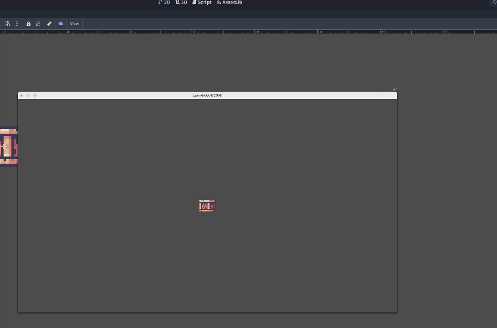

### Round 2

Goal: Create a player controlled character.

Tasks and hints:
- [ ] Take a look at [Godot's official 2D movement docs](https://docs.godotengine.org/en/stable/tutorials/2d/2d_movement.html) 
- [ ] Use a CharacterBody2D.
- [ ] Add script to the character node (use the default movement template).
- [ ] Save the character in its own scene (player.tscn).
- [ ] Add a static body to be the floor.

Learnings:
- Physics bodies, collisions and movement.
- Scenes and the node tree.

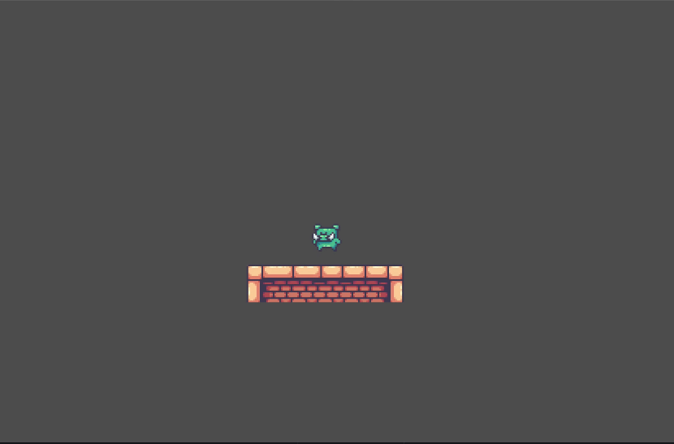

### Round 3

Goal: Use custom input maps to control the character with WASD and space.

Tasks and hints:
- [ ] Define new actions in the input map.
- [ ] Use new actions in the player script.

Learnings:
- Input map and actions.

#### Round 3 Extra challenge

Make the character's jump height variable (i.e. it's higher if holding the button, lower if just tapping).

Hint: When the player releases the jump button, reset the vertical velocity.

Learnings:
- Input handling.

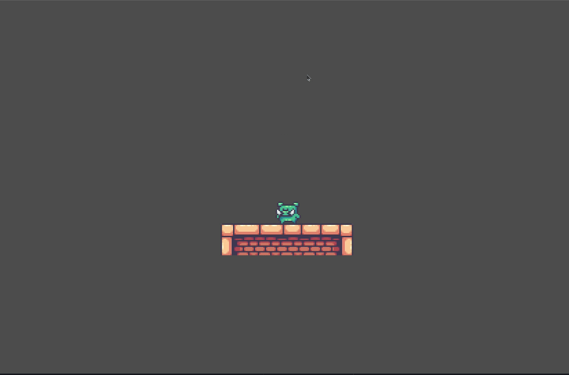

### Round 4

Goal: Animated character.

Tasks and hints:
- [ ] Use an AnimatedSprite2D.
- [ ] Add 3 animations: Idle, Walk and Jump.
- [ ] Play the right animation depending on the character's state (moving, stopped, jumping).
- [ ] Character's sprite should face the right direction when moving (flip the image).

Learnings:
- Animations (using AnimatedSprite2D).

### Round 5

Goal: Walking particles. When the character is moving, show some "dust clouds".

Tasks and hint:
- [ ] Look into Particle2D node and play with the material options.

Learnings:
- Particles.

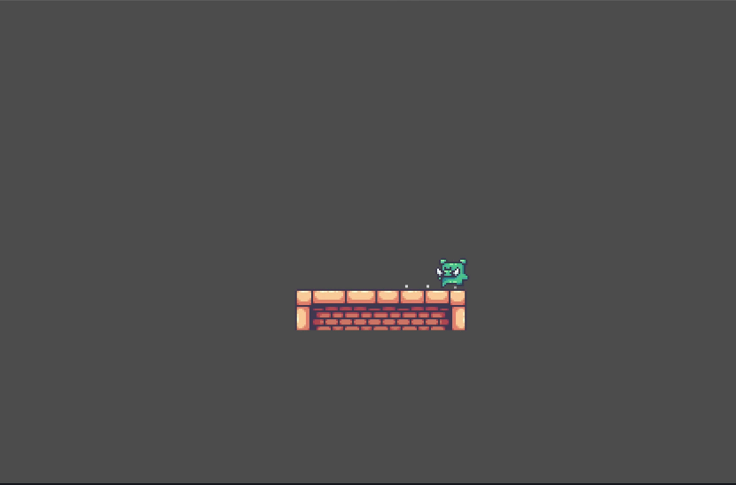

### Round 6

Goal: Create an area that slows down the character.

Tasks and hints:
- [ ] When the player enters the area, halve its speed.
- [ ] Don't forget to reset the speed back to normal when the player leaves the area.
- [ ] Make sure only the player is detected by the area (i.e. scenario colliders should not be detected).
- [ ] Hint: Area2D, Signals, Collision Layers.

Learnings:
- Areas.
- Signals.
- Collision Layers

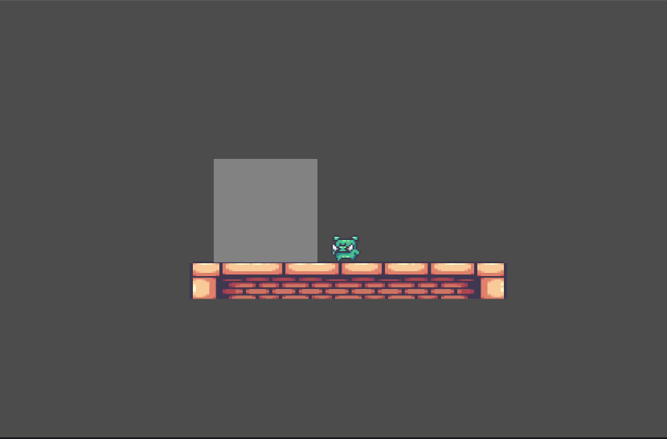

### Round 7

Goal: Add platforms that the character can jump from bellow.

- [ ] Create a platform using a static body. The character should be able to jump on top of it when coming from bellow.
- [ ] Create as least 3 platforms with different sizes by duplicating the first one.

Learnings:
- One-way collisions.
- More node shenanigans.

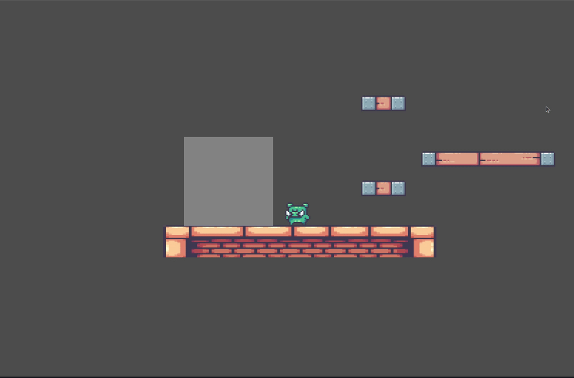

### Round 8

Goal: Create an object that moves back and forth between two positions.

Note: For simplicity, in future steps I will refer to it as "danger object"

Tasks and hints:
- [ ] Add a script to the object that keep moving it between two positions.
    - [ ] For the initial implementation, you can focus on the movement and hardcode the target positions.
- [ ] Allow the object to accept two Marker2D nodes via the editor as parameters (i.e begin_position, end_position), and use their positions as target. Hint: `@export`.
- [ ] Add this new object to the main scene and use Marker2D nodes to define where it should go.

Learnings:
- More movement logic.
- Define properties via the editor.
- Reference other nodes in the scene via properties.

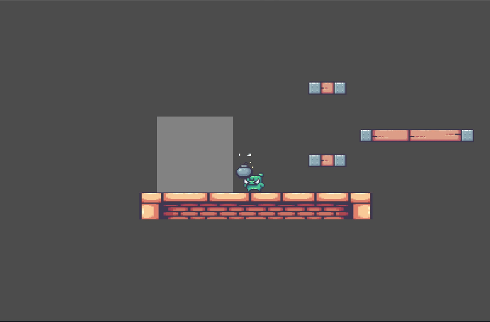

### Round 9

Goal: Make the "danger object", defined in the previous step, detect when the player was hit and reload the scene.

Tasks and hints:
- [ ] Detect the character was hit.
- [ ] Reload the current scene.

Learnings:
- How to reload scenes.
- Some more collision logic.

Note: This round is quite open ended when it comes to how to detect the collision. There is no single right way of doing this, so I will leave up to you to decide how to do it.

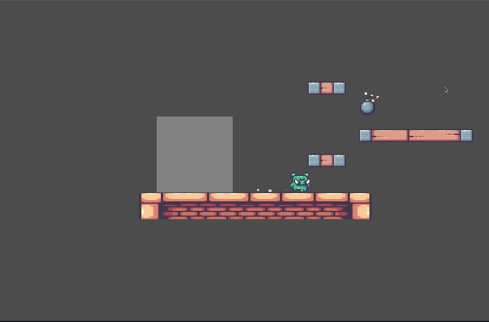

### Round 10

Goal: Implement an object that when collected will stop all danger objects for 3 seconds.

Tasks and hints:
- [ ] Stop all moving objects defined on step 8 in the scene when the character touches this power up. Hint: Groups.
- [ ] Wait for 3 seconds and resume the movement. Hint: Timer node.
- [ ] Remove the power up object from scene when collected.

Learnings:
- Node groups.
- Timers.
- Removing elements from scene in runtime.

#### Round 10 Extra challenge

Goal: Animate power up object to look like it's floating and to fade away when collected.

Tasks and hints:
- [ ] Use an AnimationPlayer.
- [ ] Move the power up sprite up and down slightly, giving a floating effect.
- [ ] When collected, make the sprite fade away before removing from scene (hint: modulate).
- [ ] Make sure player can't collect the power up again while it's fading away.
- [ ] Extra extra: You can also try to trigger some particles when the power up is collected.

Learnings:
- Animating properties with AnimationPlayer.

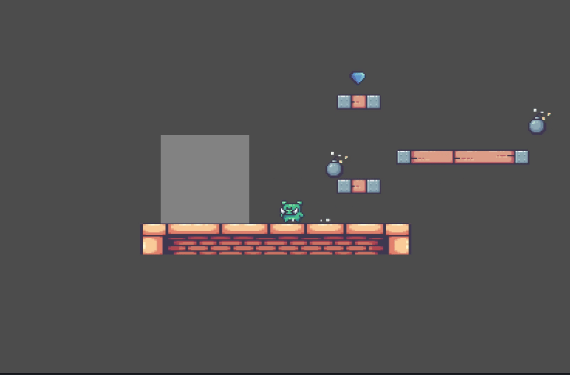

### Round 11

Goal: Implement an object that when collected ends the game in victory.

Tasks and hints:
- [ ] When player touches this object:
    - [ ] Emit a custom "collected" signal that should be listened by the level script to trigger the victory sequence.
    - [ ] Add a script to the level scene that should programmatically (via code) connect to the collected signal.
    - [ ] show a Victory message.
    - [ ] Pause scene.
    - [ ] Show button to restart the scene.
- [ ] Hint: A canvas layer can be used so the message stays on top of everything else.

Learnings:
- Control nodes (Label, Button, Containers, Etc).
- CanvasLayer.
- Custom signals, emit, connect.
- Pause tree.

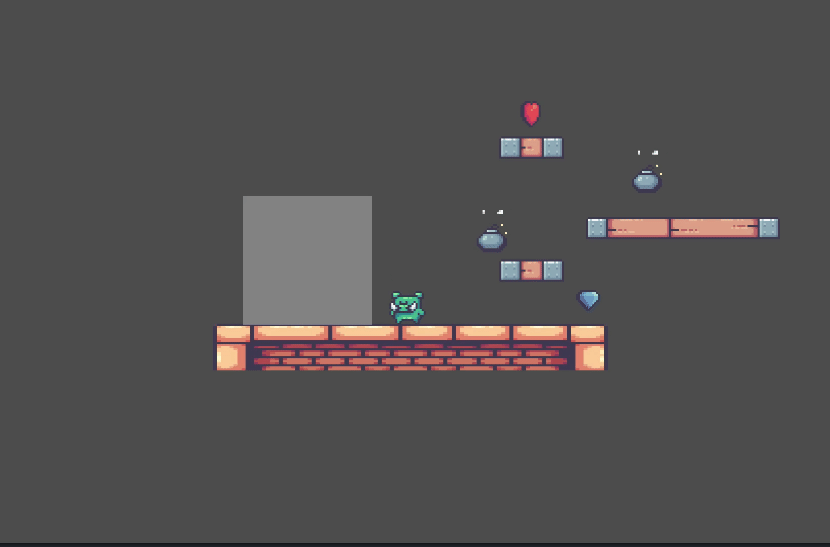

### Round 12

Goal: Use tilemaps to define the scenario.

Tasks and Hints:

- [ ] Create a new tile set.
- [ ] Define collisions directly in the tilemap.
- [ ] Delete the current floor and replace by the tilemap.
- [ ] Extra: define terrains for auto-tiling.

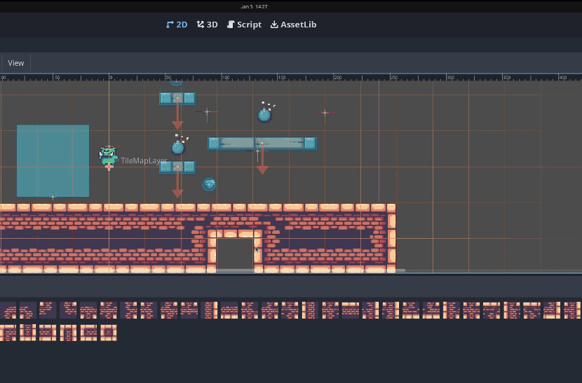

### Round 13

Goal: Add sounds to the game and create an audio bus to play the effects.

Tasks and hints:
- [ ] Add sounds to actions: jump, power up collected, victory object collected.
- [ ] Add a new audio bus just for effects and make sure audio is playing through it.
- [ ] Make victory object play constant "aura" sound which sounds louder when player character is closer. Hint: AudioStream2D and Listener2D.

Learnings:
- Audio nodes.
- Audio bus.

### Round 14

Goal: Create multiple levels using the existing building blocks.

Tasks and hints:
- [ ] Create multiple levels (different platform, flag, powerup and bomb positions). At least 3 different levels.
- [ ] On victory, show the victory message and a button to go to the next level, if available.
- [ ] The next level button should change the scene to the next level.

Learnings:
- Changing scenes.

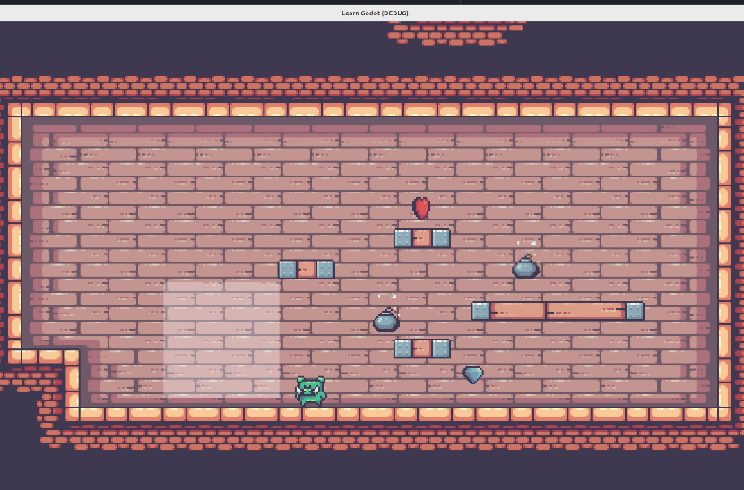

### Round 15

Goal: Create a dark level with some lights.

Tasks and hint:
- [ ] Create a level that is all dark.
- [ ] Add a light halo to player character which should iluminate a short radius around its position.
- [ ] Add a less intense light to the victory object.
- Hint: Light2D, CanvasModulate.

Learnings:
- Lights, CanvasModulate.

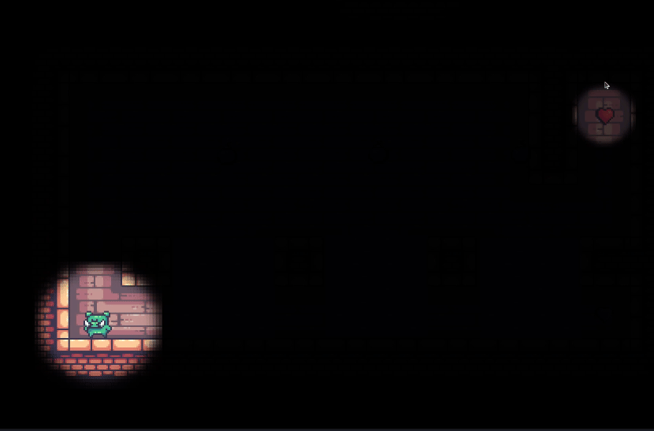

### Round 16

Goal: Persist the current level.

Tasks and hint:
- [ ] Save current level number to disk on victory. To keep things simple, only save the level number to the file.
- [ ] Save file at `user://game.save`.
- [ ] On starting the game, load the number from the file from disk, and change to the right scene.
- [ ] Change default user folder to something else, like your name. (Hint: Project settings)

Learnings:
- Writing and reading files.
- Paths and user folder.

#### Round 16 Extra Challenge

Goal: Create a global script that holds the current level number and is responsible to change to the next level. Call it `LevelManager`.

Learnings:
- Autoloads.

### Round 17

Goal: Export the game.

Tasks and hints:
- [ ] Export your game so it can be played without using the Godot Editor.

Learnings:
- Game export and export templates.

# Conclusion and next steps

Congratulations! You made a full game by yourself!

As you may already know, we just scratched the surface of the things we covered, and there is way more we didn't talk about. However, I'm confident that with the information you gathered in this journey, you know what's required to effectively develop a game with Godot.

Do you want more ideas to try next?

- Shaders: Check out the existing ones at [Godot Shaders](https://godotshaders.com/). You may find some good ones to use in the victory screen.
- Localization: We want our games to be played by as many people as possible, regardless the language they understand. What if we make the Victory message localized? Check the official [docs](https://docs.godotengine.org/en/stable/tutorials/i18n/internationalizing_games.html). It's surprisingly easy.

Want to try making another game with the knowledge you gathered?

A topdown/isometric 2D game might be a good second project. You will be able to learn:

- ySorting: Defining what sprites are shown in front depending on their y position
- Path finding: Using the NavigationServer and NavigationAgents/Obstacles you can have enemies/NPCs that walk paths and avoid collisions.

Why not doing this again in 3D?

Everything I showed you so far has a 3D equivalent. You can used [Kenney's free starter kit](https://github.com/KenneyNL/Starter-Kit-3D-Platformer) which should have all the models you will need.

I hope you enjoyed the jorney and learned something new. I'd love to know how it went. Send me a message on Mastodon, BlueSky or Youtube. Cheers!
